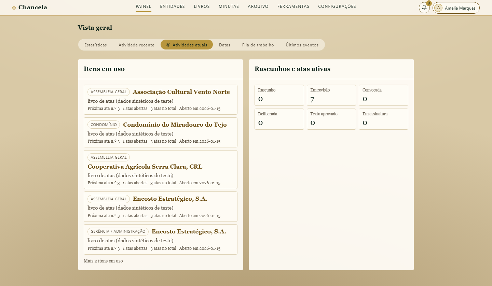

<h1 align="center">Chancela</h1>

<p align="center">
  <strong>Self-hostable, ledger-backed <em>livro de atas</em> for Portuguese collective entities.</strong><br>
  A records, signing and archive tool — not a guarantee of legal validity.
</p>

<p align="center">
  <a href="https://github.com/supermarsx/chancela/actions/workflows/ci.yml"></a>
  <a href="license.md"></a>
  
  
  
  
  
  <a href="https://supermarsx.github.io/chancela/"></a>
</p>

<p align="center">
  
</p>

## What is Chancela

Chancela is a self-hostable platform for keeping a Portuguese-style **livro de atas** (corporate
minute book) and the **atos societários** — the minutes and resolutions of a company or other
entity's governing bodies — that belong in it. Its job is to help you draft, review, and preserve
those records through a controlled lifecycle — **draft → seal → archive** — so that what a general
assembly, board, or management body decided stays organized, attributable to the people who
authored it, and hard to alter after the fact. User-authored templates give each entity type its
own house style, while role-based access with delegation keeps drafting and sealing in the right
hands.

Once an act is sealed it is written to an **append-only, hash-chained ledger** that can be
re-verified on demand: because each entry is chained to the one before it, later tampering breaks
the chain and becomes detectable. That makes Chancela a records-integrity tool — it keeps an
organized, tamper-evident history of corporate decisions, but it does **not** claim legal validity
or replace notarial and legal requirements. For the acts that call for signatures, it integrates
**qualified and advanced electronic signatures** (PAdES / XAdES / CAdES) over Portuguese rails —
**Chave Móvel Digital** and **Cartão de Cidadão** — through external providers.

Everything runs on infrastructure you control. Chancela stores its data in **SQLite or PostgreSQL**,
deploys single-node or multi-node, and is reachable through a web client, a **Tauri** desktop app,
and an **API / MCP** surface. Per-book export/import with fixity verification, GDPR tooling, and
open data formats keep your records portable rather than locked in. It is aimed at the entities and
professionals — companies, associations, condominiums, cooperatives, foundations — that need an
organized, self-controlled, and tamper-evident record of what their bodies decided.

## Key capabilities

- **Livro de atas & corporate acts** — draft, deliberate, and seal acts for multiple entity types.
- **Append-only hash-chained ledger** — every act is chained; the chain is re-verified on boot and surfaced via `/health`.
- **Portuguese qualified e-signature seams** — CMD (Chave Móvel Digital) and Cartão de Cidadão via external qualified providers.
- **Fixity export / import** — deterministic preservation packages with per-file SHA-256 digests for backup and interchange.
- **Durable, encryptable storage** — SQLite/SQLCipher (single-node) or a PostgreSQL durability profile.
- **Three editions, one core** — offline Tauri desktop, self-hosted Docker server, and browser.

See the [documentation site](https://supermarsx.github.io/chancela/) for the full capability and configuration reference.

## Quick start (Docker, single node)

The simplest way to run Chancela is the self-hosted single-node image:

```sh
docker compose -f docker/docker-compose.yml --profile single-node up --build
```

Then open <http://127.0.0.1:8080>. The container binds `0.0.0.0:8080` and stores durable
state on the `chancela-data` volume; `GET /health` should report `persistent: true` and
`ledger_verified: true`. The image is SQLCipher-capable — set `CHANCELA_DB_KEY_FILE` (or
`CHANCELA_DB_KEY`) at runtime to encrypt the store at rest.

For a production deployment, follow the **[hardened Docker guide](docs/security/hardened-docker.md)**
(read-only rootfs, dropped capabilities, non-root user, encrypted store). For local
development from source and the desktop build, see the
[documentation site](https://supermarsx.github.io/chancela/).

## How Chancela compares

Chancela is a self-hostable, ledger-backed livro-de-atas platform — a niche the alternatives
only partially cover: PT atas SaaS (Arkeyvata, atas.pt) is cloud-only; JUFIL is a book plus a
local app; Diligent is an enterprise board portal; DocuSign / Signaturit are e-signature rails;
OpenTimestamps is a timestamping primitive. Only Chancela combines **self-host + append-only
hash-chained ledger + PT qualified e-signature (CMD / Cartão de Cidadão) + fixity export/import**.

Verify the cells against your own requirements before deciding — this is a feature comparison,
not a legal-validity guarantee. Full table: **[docs/comparison.md](docs/comparison.md)**.

## Documentation

| Topic | Where |
| --- | --- |
| Full documentation site | <https://supermarsx.github.io/chancela/> |
| Configuration & deployment profiles | [`docker/DEPLOYMENT-PROFILES.md`](docker/DEPLOYMENT-PROFILES.md) |
| Security & hardening | [`docs/security/hardened-docker.md`](docs/security/hardened-docker.md) |
| Feature comparison | [`docs/comparison.md`](docs/comparison.md) |
| Product & legal specification | [`spec.md`](spec.md) |
| Contributing | Issues and pull requests are welcome on [GitHub](https://github.com/supermarsx/chancela) |
| License | [MIT](license.md) |

## Honest caveats

- **It is a records tool, not a legal shortcut.** Chancela helps produce compliant records; it
  does not create legal validity out of an invalid meeting, missing powers, or a defective
  corporate process.
- **Qualified signing needs external providers.** Qualified-signature features still require the
  appropriate qualified provider, certificate, hardware, and onboarding path — Chancela wires the
  seams but does not replace them.
- **The law corpus is tiered.** Cited diplomas carry a status tier — *Verified*, *automated-review*,
  or *pending* — so you can tell reviewed provenance from work in progress.
- **Single-node by design.** Authoritative domain state and ledger sequencing live in one process;
  exactly one instance may write. The PostgreSQL profile is a durability upgrade, not scale-out or HA.

## License

MIT — see [`license.md`](license.md).
