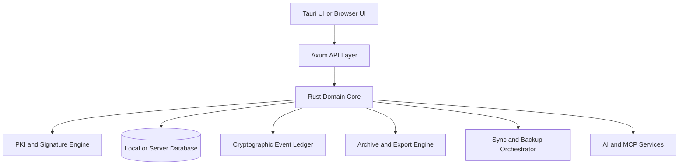

# Specification for a Portugal-Compliant Hybrid Livro de Atas and Corporate Acts Platform

## Product vision and scope

The product should be conceived as a **Portugal-first corporate records and signing platform** for managing the lifecycle of companies and other collective entities, with the **livro de atas** and related **atos societários** as the center of gravity. It should run in three equivalent modes: a fully local **offline monolith**, a **client-server deployment** for organizations, and a **browser-access deployment** backed by the same Rust core and the same legal/business rules. That approach is consistent with Tauri’s cross-platform model, which supports desktop and mobile targets from one codebase, and with an Axum-based Rust server architecture that is designed to work with Tokio and Hyper. citeturn23search1turn23search5turn40view0

The app should not be limited to simple document storage. It should be specified as a **records, signing, governance, archive, workflow, and compliance system** for Portuguese entities. At minimum, it should support companies governed by the Código das Sociedades Comerciais, but it should also support associations, foundations, cooperatives, and condominiums because Portuguese law and public services clearly distinguish these organizational forms, and because the permanent-certificate ecosystem already exposes registry and statute information for several of them. citeturn26search1turn26search8turn37search2turn37search14turn36view0turn38search3

A good name for the platform category is **“Corporate Acts Ledger and Archive”** rather than merely “minutes software.” That broader framing matters because Portuguese law treats the ata as formal evidence of deliberations, but real-world workflows also require convocatórias, presences, powers of representation, supporting documents, signature validation, registry extracts, chronology, and long-term preservation. In commercial companies, Article 63 of the CSC makes the ata central to proof of shareholders’ resolutions and specifies mandatory contents; for sociedades anónimas, Article 388 requires an ata for each general meeting; for condominiums, Decree-Law 268/94 likewise makes minutes mandatory and now expressly permits qualified electronic signatures or handwritten signatures on the original or a digitized document. citeturn5view0turn6view0turn36view0

## Portuguese legal and compliance baseline

The legal baseline of the product should be built around the idea that **the app helps produce compliant records, but does not itself create legal validity out of an invalid meeting, missing powers, or defective corporate process**. The software must therefore distinguish between **substantive validity** and **documentary evidence**. In Portugal, Article 63 of the CSC requires that minutes contain, at least, the identity of the company, place, date and time of the meeting, the president and secretaries, the names of those present or represented, agenda, references to submitted documents, the text of resolutions, voting results, and statements requested by members. It also requires anti-falsification precautions when loose leaves are used and warns that resolutions found only in detached private documents are merely a beginning of proof. citeturn5view0

The product therefore needs a **compliance engine** that checks, before finalization, whether every ata contains the legally required fields for its entity and meeting type. For commercial companies, this means a rule pack for CSC Article 63 and related meeting provisions. For sociedades anónimas, the product must also support telematic general meetings, because Article 377 allows meetings through telematic means provided the company ensures authenticity of statements, communication security, and recording of content and participants; the same logic applies to board meetings where telematic means are permitted. citeturn5view0turn7view0turn7view1

For **condomínios**, the platform should ship a separate compliance profile. Decree-Law 268/94 requires minutes of condominium assemblies, specifies that the ata must summarize the essential matters discussed and the result of each vote, and states that signatures may be qualified electronic signatures or handwritten signatures on the original or on a digitized document with other signatures. It also recognizes email declarations confirming agreement with the contents of the ata as annexes to the original. This means the product should not treat condominium workflows as merely “corporate-company lite”; they deserve a dedicated template family, signature workflow, and archive model. citeturn36view0

The entity model should offer, at minimum, the following Portuguese forms:

| Entity family | Minimum selectable types | Legal grounding |
|---|---|---|
| Commercial companies | sociedade em nome coletivo, sociedade por quotas, sociedade unipessoal por quotas, sociedade anónima, sociedade em comandita simples, sociedade em comandita por ações | CSC Article 1 and the unipessoal regime in the CSC/ePortugal company creation flows. citeturn26search1turn26search4turn26search0 |
| Cooperatives | cooperativa | ePortugal explicitly treats cooperatives as a separate creation path and permanent-certificate records show cooperative registrations. citeturn37search7turn37search17 |
| Associations | associação and subtypes configured by statutes | The Civil Code treats associations as private legal persons; ePortugal exposes association creation and operation flows. citeturn37search14turn37search7 |
| Foundations | fundação | The Civil Code and the Lei-Quadro das Fundações expressly govern foundations, and gov.pt exposes foundation registry services. citeturn37search1turn37search2turn38search3turn38search9 |
| Condominiums | condomínio in propriedade horizontal | Decree-Law 268/94, as revised in 2022, governs minutes and remote meetings. citeturn36view0 |

Because the user asked for **permanent-registry integration**, the product should support importing company and entity data from the **certidão permanente** by access code. The official gov.pt commercial-registry services state that the access code allows consultation of the online commercial registry, associated electronic documents, and the latest updated articles of association/statutes; for FCPC records it also exposes NIPC, company name, seat, CAE, legal nature, object, and status. For foundations, the same model exists through a foundation permanent-certificate service. citeturn38search3turn38search0turn38search9

On privacy, the baseline should be **GDPR by design and by default**, not a bolt-on. The GDPR requires data minimization and purpose limitation, and Article 25 explicitly requires data protection by design and by default. Article 32 requires appropriate technical and organizational security, while Article 35 requires a DPIA where processing is likely to result in high risk. CNPD guidance also emphasizes internal incident management, controls over processors, encryption, and the ability to restore availability after technical or physical incidents. citeturn35search1turn35search3turn20search1turn20search2turn20search9

That means the specification should require all of the following: tenant isolation; per-company access scoping; field-level redaction for guest users; configurable retention schedules; legal-hold support; data subject rights workflows; processor/subprocessor registry; records of processing activities; breach-response playbooks; and transfer controls for any data that leaves the EEA or is stored with third-party sync providers. Encryption is strongly recommended, but the product should state clearly in its privacy architecture that **zero-knowledge encryption reduces exposure but does not automatically remove GDPR obligations**, because encrypted personal data and usage metadata are still part of regulated processing. That is an inference grounded in GDPR design/security duties and CNPD/EDPB guidance on encryption and breach risk. citeturn35search1turn35search12turn20search9

## Identity, signatures, trust services, and evidentiary model

The signing stack must clearly separate **identity**, **signature method**, **trust service**, and **evidentiary result**. In EU and Portuguese law, a **qualified electronic signature** has the equivalent legal effect of a handwritten signature, and Portuguese Decree-Law 12/2021 states that placing a qualified electronic signature on an electronic document is equivalent to a handwritten signature and creates presumptions as to identity or representation, intent to sign, and document integrity. citeturn39search0turn19view0

For Portugal, the app should natively support four signing families:

| Signing family | Product requirement | Legal/evidentiary position |
|---|---|---|
| Cartão de Cidadão qualified signature | Native signing with smartcard reader, CC signature PIN, certificate status checking, optional professional attributes | The Citizen Card includes an authentication certificate and a qualified certificate for qualified electronic signature; the qualified certificate is optional to activate. citeturn33search0 |
| Chave Móvel Digital qualified signature | Native signing with CMD activation, CMD signature PIN, and OTP/security-code confirmation via SMS, email, gov.pt app, QR, or biometrics where available | CMD is a legally regulated means of authentication and qualified electronic signing; Autenticação.gov states that CMD signing requires active CMD, active signature function, and the CMD signature PIN, while the CMD auth flow uses a temporary security code. citeturn16search4turn15search0turn15search1 |
| Other qualified digital certificates | Import and use of qualified certificates from Portuguese or EU qualified trust service providers, including representative and professional certificates | Qualified trust services are governed by eIDAS and Decree-Law 12/2021; GNS is the Portuguese supervisory body and manager of the national trusted list. citeturn19view0turn9search0 |
| Manual signatures | Allow handwritten-signature workflows with scanning and archival, but show explicit warnings about reduced automation and the need to preserve originals | CSC Article 63 and condominium rules support handwritten signing, but detached private documents have weaker evidentiary force for company resolutions; manual workflows must therefore be explicitly labeled and archived with original-reference metadata. citeturn5view0turn36view0 |

A crucial product distinction is that **an OTP code alone is not the same thing as a qualified signature**. The product may absolutely support OTP-based consent or confirmation flows, but it must label them correctly. A temporary code can be part of the CMD qualified-signature journey, yet the automatic handwritten-equivalence rule is attached to the **qualified electronic signature**, not to a generic OTP event. Therefore the UI must never tell the user that “OTP signing” is automatically equivalent to a handwritten signature unless that OTP is being used inside a qualified trust-service flow such as CMD remote signing. This is a necessary legal inference from eIDAS Article 25 and Decree-Law 12/2021 Article 3. citeturn39search0turn19view0

The trust-service registry in the app should be driven by the **Portuguese Trusted List** and not by a manually curated spreadsheet. GNS is the Portuguese supervisory body for eIDAS and is responsible for creating, maintaining, and publishing the national trusted lists, while the EU trusted-list framework exists for all Member States. The Portuguese TSL published by GNS in May 2026 includes entries such as CEGER/ECCE, Instituto dos Registos e do Notariado, Justiça, ECAR, Multicert, British Telecommunications plc, DigitalSign, ACIN iCloud Solutions/Global Trusted Sign, AMA, and NOS. The product should ingest the signed TSL, cache it, validate it, and expose only the services whose current status is appropriate for the intended operation. citeturn9search0turn9search10turn11view0turn13view0turn14view0turn14view1

That provider registry should drive three user-facing capabilities. First, users should be able to **discover** approved providers and trust services. Second, administrators should be able to **configure policy** so that only approved providers, certificate policy OIDs, and signature levels are accepted. Third, the product should expose **“buy/add certificate” pathways** that open the provider’s official landing or purchase page. For currently visible public examples, DigitalSign, Multicert, and Global Trusted Sign all expose product pages for qualified certificates or qualified signing services; the app should treat those links as provider metadata, not hard-coded truth, because qualified status must always come from the TSL rather than a marketing page. citeturn28search15turn28search1turn28search2

The app should also support **professional and representative signing attributes**. Portugal’s Citizen Card/Autenticação ecosystem supports professional attributes through SCAP, and the legal framework has expressly added professional attributes to Citizen Card signing. That matters because many acts need to be signed not merely by a natural person, but by a person acting in a professional role or on behalf of a legal entity. citeturn28search3turn16search7turn16search12turn17search2

For long-term evidence, the signing subsystem should support **PAdES for PDFs**, **XAdES/CAdES/ASiC** for non-PDF structured or detached workflows, and baseline **B-B, B-T, B-LT, and B-LTA** style preservation profiles. The European Commission’s DSS documentation explicitly covers XAdES, CAdES, PAdES, JAdES, and ASiC, and explains long-term validation material and timestamp levels. Even if the main application core is Rust, the architecture should allow either a native Rust validator or an optional validation sidecar that cross-checks signatures and timestamps against EU trust-list data. citeturn29search0turn29search2turn29search9turn29search16

## Product requirements and user workflows

The data model should be **hierarchical and tenancy-aware**:

- **Platform**
- **Tenant**
- **Company or Entity**
- **Book**
- **Meeting/Act**
- **Document set**
- **Signature envelope**
- **Registry/ledger event**
- **Archive package**

That structure is necessary because one user may belong to multiple companies; one company may belong to a group; one entity may have multiple books; and a single act may produce several artifacts, including draft text, attendance list, attachments, signed final PDF/A, validation report, and export package. The platform should support **groups of companies**, **shared template libraries**, and **cross-entity dashboards** while preserving per-entity legal books and audit trails. The permanent-certificate services and ePortugal company flows confirm that statutes, associated electronic documents, and legal-entity registry data are distinct but related records, which supports this layered model. citeturn38search3turn38search0

The role model should combine **RBAC** and **attribute-based constraints**. Recommended default roles are: Platform Administrator, Tenant Administrator, Company Owner, Corporate Secretary, Legal Counsel, Records Manager, Signatory, Reviewer, Auditor, Guest, and API Client. Permission scopes should include company, book, act, folder, template library, archive, and integration. Delegation should be first-class: the app should support temporary and revocable delegation of signing rights, review rights, and management rights, while recording the legal basis, scope, start/end dates, and revocation status. Because Portuguese qualified-signature law draws significance from representation and powers, the system must not treat delegation as a cosmetic convenience; it belongs in the evidentiary trail. citeturn19view0turn17search2

The main business workflow should be **draft → review → convene → deliberate → approve text → sign → seal/finalize → archive → optionally sync/export → optionally register/report**. Within that lifecycle, the software should support:

- creating minutes from **templates** or prior acts;
- attaching convocatórias, agendas, proxy documents, attendance lists, reports, and exhibits;
- collecting signatures from one or many signatories in serial or parallel order;
- differentiating **signatory roles** such as chair, secretary, member, manager, administrator, attorney, or condo owner;
- inviting external signers by secure link with strict expiration and identity requirements;
- capturing the meeting channel, including physical, hybrid, telematic, or written-resolution flows;
- generating compliance warnings if the user attempts to finalize an act with missing mandatory content, missing signatures, inconsistent representation, or an unsupported signature type for the intended legal effect. citeturn5view0turn7view0turn36view0

The app should also support **blocking** an ata. In system terms this should be called **“finalize and lock”** or **“seal the act”**. Once sealed, the act becomes append-only: the textual payload, attachments, signatory list, validation report, and event hash can no longer be edited. Any later correction must be a new act that references the earlier one. This design directly reflects Article 63’s anti-falsification logic and the evidentiary presumption of integrity attached to qualified signatures and qualified timestamps. citeturn5view0turn19view0

For users who insist on handwritten paper workflows, the app should allow a **manual-signature mode** but present a prominent warning such as: *“This act may still be legally valid, but the digital copy is not being finalized with a qualified electronic signature. Preserve the original signed paper or original digitalized signature chain.”* That warning is especially important for company minutes that are not kept in the proper book or properly numbered loose-leaf system, because the CSC gives detached private documents weaker evidentiary treatment. citeturn5view0

Template coverage should be broad. The product should ship with Portuguese templates for at least: general meeting minutes; approval of accounts and appropriation of results; appointment and dismissal of management; increase and reduction of capital; change of registered office; change of object; transfer of quotas; supplementary contributions; board resolutions; delegation of powers; dissolution; liquidation steps; merger and demerger support; amendment of articles; remuneration decisions; written resolutions where admissible; condominium assemblies; association general assemblies; and foundation board resolutions. This aligns with the types highlighted by current Portuguese-market practice guides such as atas.pt, though the app’s compliance logic must always be driven by law and the entity’s statutes rather than by generic templates. citeturn27search0turn27search2turn27search7

The dashboard should be highly configurable and include: overdue signatures, unsigned drafts, acts awaiting validation, approaching annual meetings, unarchived originals, certificate expiry, failed sync jobs, pending backups, legal-hold items, chronologies of shareholders/managers, and unresolved compliance warnings. The reminders engine should support event-based reminders and calendar rules, with per-tenant and per-company policies. Because CSC Article 376 fixes the annual-meeting timing for sociedades anónimas and Portuguese company practice requires recurring accounts-approval workflows, those reminders should ship with legal-calendar presets instead of starting empty. citeturn6view0turn27search5

## Technical architecture, offline parity, sync, backups, and security

The cleanest architecture is a **single Rust domain core** reused by every deployment mode. The offline Tauri app should embed the same capabilities that the server edition exposes over HTTP. In offline mode, a local Axum server can run in-process or on loopback, with the Tauri front-end consuming the same APIs the browser client would use in server mode. Online mode then becomes a packaging change, not a product fork. That matches Tauri’s composable architecture and cross-platform model. citeturn23search8turn23search19turn40view0

The architecture should look like this:

The **Rust domain core** should own business rules, legal validation, workflow state, diffing, templates, entity modeling, audit/event generation, and import/export conversions. The **Axum API layer** should be thin and focused on transport, authn/authz, and streaming. Axum is well suited because it is built around predictable async handlers, extractors, Tower middleware, and Tokio/Hyper compatibility. citeturn40view0turn40view3

For desktop and mobile, **Tauri v2** is the right wrapper. The official docs state that Tauri supports Linux, macOS, Windows, Android, and iOS from a single codebase, and the mobile development flow is now part of Tauri’s documented toolchain. That makes it reasonable to require phone and tablet compatibility from the start, but the mobile UI should be a task-focused subset rather than a pixel-for-pixel copy of the desktop experience. Mobile should prioritize review, approval, signing, alert triage, and quick company lookup. citeturn23search1turn23search5turn23search13

For data management, the product should support **local-first storage** with **selective sync**. The canonical model should be append-only event sourcing for acts and books, combined with durable materialized views for speed. Every meaningful mutation should generate a **ledger event** containing the actor, justification, timestamp, entity scope, prior event hash, and payload digest. Per company, per book, and globally, the system should maintain a cryptographic chain so that tampering with sequence or content is detectable. For stronger non-repudiation, the product should optionally checkpoint finalization events with a **qualified timestamp** from a trusted provider; Portuguese law gives qualified timestamps a presumption regarding the time indicated and document integrity. citeturn19view0turn29search16turn28search9

Sync and backup must be treated as **different subsystems**. Sync is for active replicas and collaboration. Backup is for recovery, retention, and forensic continuity. The product should therefore allow multiple independent targets for each. For example, an organization may sync working data to a self-hosted server and also back up encrypted archive packages to S3-compatible storage, OneDrive, and Nextcloud. This distinction is consistent with CNPD/EDPB guidance emphasizing restoration capability, incident resilience, and processor controls. citeturn20search1turn20search9

Recommended sync and backup targets are:

| Target | Integration approach | Grounding |
|---|---|---|
| OneDrive / SharePoint | Microsoft Graph file/storage APIs with resumable upload support | Microsoft documents OneDrive upload and upload-session flows. citeturn24search0turn24search10 |
| Google Drive | Google Drive API for upload, search, foldering, and revisions | Google documents file uploads, file creation, and file search. citeturn24search1turn24search8turn24search11 |
| Nextcloud | WebDAV | Nextcloud officially documents WebDAV file and folder operations. citeturn24search2turn24search6 |
| SMB, FTP/FTPS, SFTP/SSH | Native connector modules | These should be treated as infrastructure connectors, with FTPS/SFTP preferred over plain FTP in production. |
| Local disk / NAS | Native file-system target | Required for fully offline and air-gapped use. |

The **zero-knowledge encryption** design should be opt-in at the tenant or repository level. In that mode, content encryption keys are derived client-side and never leave the trust boundary in plaintext. Server-side services may still store opaque blobs, manifests, metadata envelopes, and recipient-wrapped keys. The product should support bring-your-own-key, hardware-token-backed key unsealing where possible, and split-key recovery for continuity plans. It should also support a “legal archive readability” mode, where the archive package can be transferred to another document-management system with the right decryption material and manifest documentation. This is the safest way to support third-party sync targets without giving them plaintext business records. The justification for this design is the GDPR/ CNPD emphasis on appropriate security, encryption, restoration capability, and processor governance. citeturn35search1turn20search1turn20search9

Dockerization should be a first-class deliverable. The server distribution should publish at least: an application image, a worker image, and an optional validation/AI sidecar bundle. Docker’s official guidance recommends running non-privileged processes inside containers, and rootless mode exists specifically to reduce risk from daemon/runtime vulnerabilities. Build best practices also favor minimal images and avoiding unnecessary packages. Accordingly, the spec should require: rootless or non-root images, read-only root filesystem where possible, dropped Linux capabilities, signed images, SBOM generation, vulnerability scanning, secret injection through runtime secrets rather than image baking, and separate profiles for single-node and HA deployment. citeturn23search0turn23search3turn23search18

## Documents, archives, exports, templates, analytics, and AI

The document layer should distinguish **authoring formats**, **evidence formats**, and **archive formats**. For evidence, the primary final format should be **PDF with PAdES signatures**, and the preservation profile should default to **PDF/A**. For accessibility-sensitive outputs, the app should offer **PDF/UA**-aligned generation. The PDF/A family is widely treated as suitable for long-term preservation, while ISO’s PDF/UA standard exists to represent accessible electronic documents. The practical recommendation is: **PDF/A-2u or PDF/A-3u for signed outputs today, with PDF/UA where accessible delivery is required, and optional PDF/A-4 for specific modern workflows**. citeturn22search2turn22search13turn22search16turn22search1turn22search4

For non-signed export, the app should support **DOCX, ODT, RTF, HTML, TXT, Markdown, and plain DOC import** through a conversion pipeline, but the UI must explicitly state that these exports are **working copies**, not the legally preserved signed originals. A sealed act should always preserve: the final signed PDF, the signature-validation report, the structured metadata, the attachments manifest, and the original editable source if available. This separation is necessary because the editable convenience format and the evidentiary record serve different purposes. The long-term-preservation guidance from DGLAB emphasizes preservation planning, collaboration between archive and IT functions, and maintaining integrity and usability of digital records over time. citeturn21search0turn21search3turn21search10

Import support should be extensive. Beyond office documents, the product should accept PDFs, images, ZIP-based bundles, XML, CSV, and email attachments used as supporting records. The signature/validation subsystem should be able to validate signed PDFs and detached evidence envelopes. The archive subsystem should generate an **export package** that can be ingested by another archival or documental system, including checksums, provenance, rights metadata, language metadata, signing evidence, and retention instructions. DGLAB’s preservation guidance and archive manuals support designing for preservability and controlled migration from the outset. citeturn21search10turn21search14

A major differentiator should be **chronology and relationship intelligence**. Since certidão permanente records and articles/statutes expose legal-entity history, the app should parse imported registry content into a normalized event timeline: constitutions, quota transfers, capital changes, management appointments and cessations, seat changes, object changes, dissolutions, and other acts. From that graph, the app should generate **Mermaid** diagrams for shareholders, managers, delegated powers, and inter-company relationships. Current market examples such as atas.pt already show demand for automatically reconstructed chronologies and societary reports, but your platform should turn that into a native, explainable graph feature with or without AI assistance. citeturn27search9turn38search3

The AI layer should be helpful but subordinate to legal controls. Recommended features are: template drafting from prompts; extraction of meeting metadata from uploaded convocatórias and reports; comparison between draft and signed version; automatic generation of convocatórias and resolutions from prior acts; chronology summarization; multilingual drafting in PT-PT and EN-US by default, with up to ten locales in total; and explanation panels that tell the user which statement in the draft came from law, certificate data, registry data, prior company records, or AI suggestion. Every AI-generated act should require a **human verification checkpoint**, because the software must help users verify content accuracy rather than implying that automation makes the act legally true by itself. That design follows the evidentiary importance of the ata in Portuguese law and the user’s own requirement that the system warn users to verify contents. citeturn5view0

An **MCP server** is a good fit for the platform. MCP is an open standard that lets AI clients discover tools, resources, and prompts exposed by a server. In this product, the MCP server should safely expose read-only and write-controlled tools such as `list_companies`, `get_company_timeline`, `draft_minutes`, `validate_signature_bundle`, `search_legal_texts`, `generate_mermaid_graph`, and `prepare_archive_export`. That would let external AI tools connect to the records platform in a standardized way without resorting to brittle screen scraping. citeturn32search0turn32search6turn32search9turn32search23

The legal-text library should ingest official sources from **Diário da República** and **EUR-Lex**, store them in a search index, and preserve official identifiers. The DR portal exposes stable ELI-style pages for legislation, and EUR-Lex offers web services for searching EU legal content. The product should therefore include an internal “law shelf” with full-text search, topic filters, pinned references per template, and citation insertion into drafting workspaces. citeturn25search0turn25search1turn25search5

From a design system perspective, the user-requested visual direction is coherent: **dark green, white, old-school editorial styling, NYT-inspired typography**, plus robust light and dark themes. That should be expressed as a theme package layered on top of an accessibility-aware UI system, not as a fragile CSS skin. The product can ship a locally bundled set of open-licensed Google Fonts across serif, sans, monospaced, and display families, but the default typographic system should remain conservative in formal documents so that archive, print, and PDF/A generation remain predictable.

## Delivery shape, licensing, and decisions that materially affect scope

The best delivery shape is a **single MIT-licensed codebase** with edition flags rather than three separate products. The recommended editions are:

| Edition | Packaging | Intended use |
|---|---|---|
| Personal / Offline | Tauri desktop app with embedded local server and local database | Single professional, air-gapped or low-connectivity use |
| Team / Self-hosted | Dockerized server, browser UI, optional Tauri desktop clients | SMEs, law firms, accounting offices, property managers |
| Mobile Companion | Tauri mobile app with secure local cache | Approval, signing, alerts, quick lookup, disaster continuity |
| Enterprise | HA server deployment, SSO, admin panel, policy engine, HSM/KMS options, validation sidecars | Medium and large organizations |

The first implementation should prioritize the legally hardest path: **Portuguese company minutes with qualified electronic signatures, validation, archive, and chronology**, because that foundation also solves much of the condominium, association, and foundation problem. The shortest credible path is therefore: commercial companies first; then condominium and association packs; then foundations and cooperative refinements; then advanced group/company transfers and continuity plans; then broader AI/MCP and external integrations.

There are only a few decisions that will materially change effort and should be explicitly confirmed before build-out begins:

| Decision area | Default recommendation |
|---|---|
| Local database | Use an embedded relational store with encrypted pages and append-only event tables for offline mode; keep server mode compatible with a stronger central RDBMS if needed. |
| Signature validation | Build native Rust validation for the common path, but keep an optional EU DSS-compatible validation sidecar for cross-checking long-term and edge cases. |
| Zero-knowledge scope | Make it repository-level and opt-in, because universal zero-knowledge can complicate server-side search, previews, and workflow automation. |
| OCR and content extraction | Keep OCR modular and off by default for sensitive tenants; prefer native text extraction where possible. |
| Mobile scope | Make mobile a review/sign/alert/lookup client first, with limited drafting and no heavy archive administration in v1. |
| Provider purchasing links | Source trust status from the Portuguese TSL; source purchase URLs from an admin-curated provider catalog that can be updated without code releases. |

If those defaults are accepted, the resulting system will satisfy the core brief: a **Tauri-based, Rust-first, legally aware, online/offline-capable platform for Portuguese livro de atas and acts management**, with qualified-signature interoperability, trustworthy archival behavior, strong security controls, multi-entity operation, extensive configurability, modern sync/backup options, and a defensible evidentiary model grounded in Portuguese and EU law. citeturn23search1turn40view0turn19view0turn9search0turn38search3turn21search10