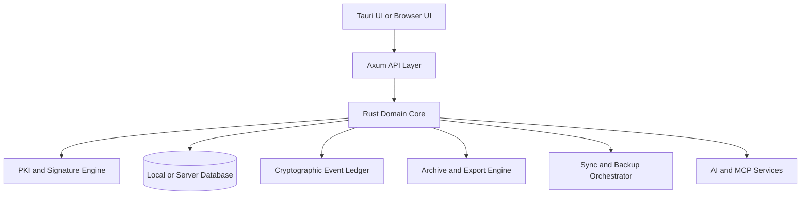

# 07 — Technical Architecture

Requirement prefix: `ARC`

## 1. Single Rust domain core

- **ARC-01** One **Rust domain core** MUST be reused by every deployment mode. It owns:
  business rules, legal validation (rule packs), workflow state, diffing, templates,
  entity modeling, audit/event generation, and import/export conversions.
- **ARC-02** The **Axum API layer** MUST be thin: transport, authn/authz, streaming.
  (Axum fits: predictable async handlers, extractors, Tower middleware, Tokio/Hyper.)
- **ARC-03** In offline mode, a local Axum server runs in-process or on loopback; the
  Tauri front-end consumes the same APIs the browser client uses in server mode (SCP-11).
- **ARC-04** Desktop and mobile clients use **Tauri v2** (Linux, macOS, Windows, Android,
  iOS from one codebase). Mobile is the task-focused subset defined in SCP-21.

## 2. Storage and event ledger

- **ARC-10** Storage MUST be **local-first** with **selective sync**.
- **ARC-11** The canonical model MUST be **append-only event sourcing** for acts and books,
  with durable materialized views for read performance.
- **ARC-12** Ledger events carry actor, justification, timestamp, entity scope, prior
  event hash, and payload digest (DAT-10); hash chains per company, per book, and globally
  (DAT-11).
- **ARC-13** Finalization events SHOULD support optional checkpointing with a **qualified
  timestamp** (SIG-22).
- **ARC-14** Local database default per SCP-D1: embedded relational store with encrypted
  pages and append-only event tables; server mode compatible with a central RDBMS.

## 3. Sync vs. backup (different subsystems)

- **ARC-20** Sync (active replicas, collaboration) and backup (recovery, retention,
  forensic continuity) MUST be separate subsystems with independently configurable
  targets. Example: sync working data to a self-hosted server while backing up encrypted
  archive packages to S3-compatible storage, OneDrive, and Nextcloud. (Grounded in
  CNPD/EDPB restoration-capability guidance — LEG-12.)
- **ARC-21** Supported targets:

| Target | Integration approach |
|---|---|
| OneDrive / SharePoint | Microsoft Graph file APIs with resumable upload sessions |
| Google Drive | Google Drive API (upload, search, foldering, revisions) |
| Nextcloud | WebDAV (officially documented file/folder operations) |
| SMB, FTPS, SFTP/SSH | Native connector modules; FTPS/SFTP preferred over plain FTP in production |
| Local disk / NAS | Native file-system target; required for fully offline/air-gapped use |

## 4. Zero-knowledge encryption (opt-in)

- **ARC-30** Zero-knowledge encryption MUST be opt-in at the tenant or repository level
  (SCP-D3). In ZK mode, content-encryption keys are derived client-side and never leave
  the trust boundary in plaintext; servers store opaque blobs, manifests, metadata
  envelopes, and recipient-wrapped keys.
- **ARC-31** The design MUST support: bring-your-own-key; hardware-token-backed key
  unsealing where possible; split-key recovery for continuity plans.
- **ARC-32** A **"legal archive readability" mode** MUST exist: an archive package can be
  transferred to another document-management system together with the right decryption
  material and manifest documentation.
- **ARC-33** UI and docs MUST carry the LEG-13 caveat: ZK reduces exposure but does not
  remove GDPR obligations.

## 5. Containerization and deployment security

- **ARC-40** Docker is a first-class deliverable. The server distribution MUST publish at
  least: an application image, a worker image, and an optional validation/AI sidecar
  bundle.
- **ARC-41** Images MUST follow container hardening practice: rootless or non-root
  processes; read-only root filesystem where possible; dropped Linux capabilities; minimal
  base images; signed images; SBOM generation; vulnerability scanning; secrets injected at
  runtime (never baked into images).
- **ARC-42** Deployment profiles MUST exist for **single-node** and **HA** setups;
  Enterprise adds SSO, policy engine, and HSM/KMS options (SCP editions table).
